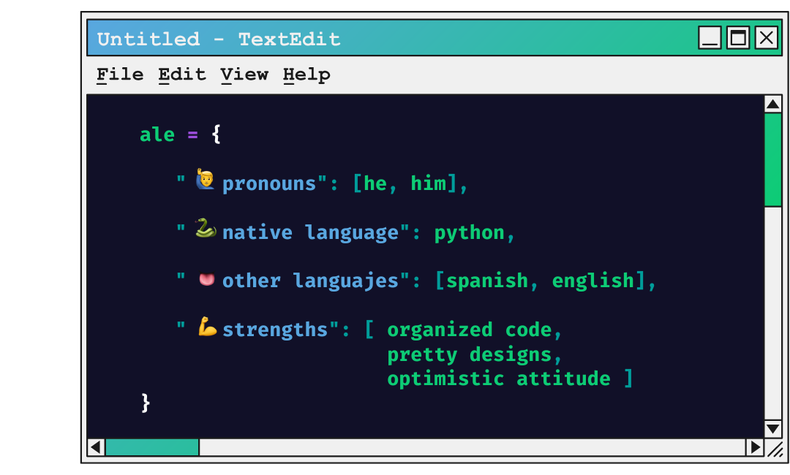

# 👋 EpAle!

#### *A software developer eager to collaborate and learn new things.*

## About me

💻 Currently in my last year of software engineering 👀 Looking to collaborate on Web development and AI projects 🐍 Learning data science and machine learning with python 🌍 An earthling born in Venezuela

## Tech Stack:

         

##### Learning: Node.js, React.js & React Native